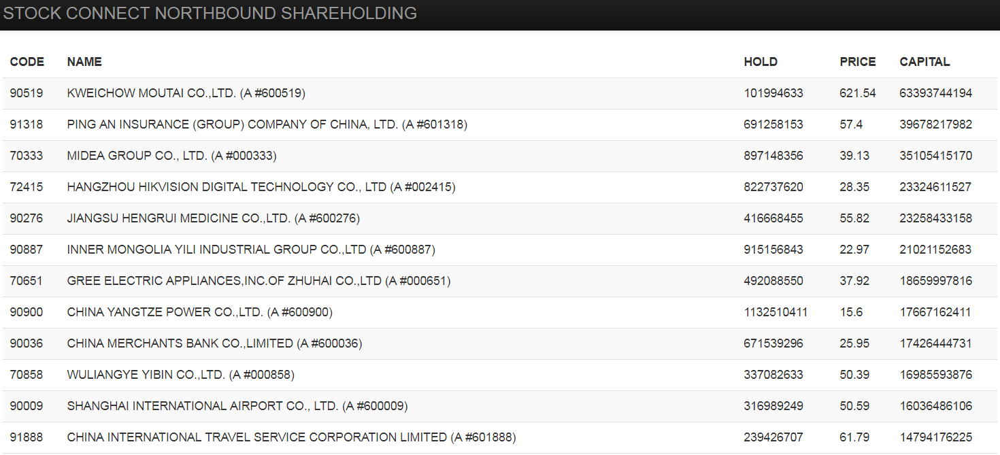

# collect-hkc-hold-position

> 自从沪深港通开通后，海外机构资金源源不断买入他们眼中最稀缺、最有价值的A股，并长期持有。

港交所从2017年3月17日起，每天公布沪深港通持股数量:

* http://www.hkexnews.hk/sdw/search/mutualmarket.aspx?t=sh
* http://www.hkexnews.hk/sdw/search/mutualmarket.aspx?t=sz

项目自动收集沪深港通持股数，聚合实时价格数据以获得持有市值排名。

以docker方式进行部署，共三部分：

1. collector 爬取沪深港通持股数并用雪球API获取对应价格
2. redis 作为数据存储载体
3. web 使用tornado框架作为数据展示应用

## WEB截图

Demo 地址：[http://hkcrank.crackcreed.com/](http://hkcrank.crackcreed.com/)



## 安装

```bash
$:~/workdir/collect-hkc-hold-position#
$:~/workdir/collect-hkc-hold-position# docker-compose up -d
Creating collecthkcholdposition_redis_1 ...
Creating collecthkcholdposition_redis_1 ... done
Creating collecthkcholdposition_web_1 ...
Creating collecthkcholdposition_collect_1 ...
Creating collecthkcholdposition_web_1
Creating collecthkcholdposition_web_1 ... done
$:~/workdir/collect-hkc-hold-position# docker-compose ps
              Name                            Command               State            Ports
---------------------------------------------------------------------------------------------------
collecthkcholdposition_collect_1   /bin/sh -c cron && tail -f ...   Up
collecthkcholdposition_redis_1     docker-entrypoint.sh redis ...   Up      6379/tcp
collecthkcholdposition_web_1       /bin/sh -c python3 app.py        Up      0.0.0.0:20191->5000/tcp
```

---

有任何问题请联系我。


